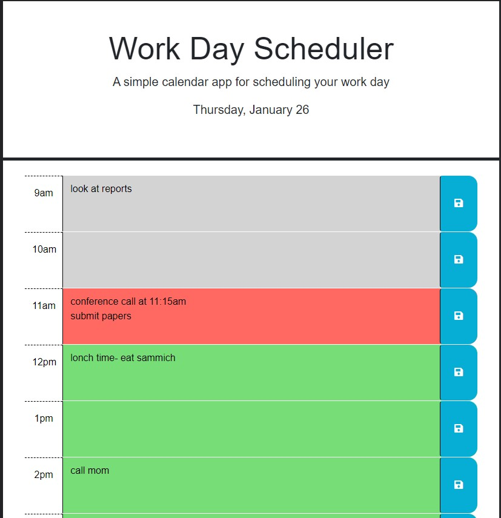

# Work Day Scheduler

## Description

This project is a work day scheduler that will allow a typical 9am-5pm worker save events/tasks for each hour of their work day. It allows the user to be organized and manage their time more effectively by visualizing their day through color-blocking. Time passed will be displayed in grey, the current hour will be red, and time remaining will show up as green.

## Deployed Application

https://jjocelynn.github.io/work-day-scheduler/

## Usage

The current date will be shown underneath the title and paragraph text. As mentioned above, time that has passed will show up as grey, current time will be red, and time remaining of the work day will be green.

Users can enter text and save it using the button on the right. Any saved entries will be stored on the users local storage so if they leave the page and come back, or refresh the browser, their tasks will remain as they previously were.

## Credits

https://www.w3schools.com/jsref/met_node_clonenode.asp
for cloning nodes

## License

Please refer to the License in the repo.
